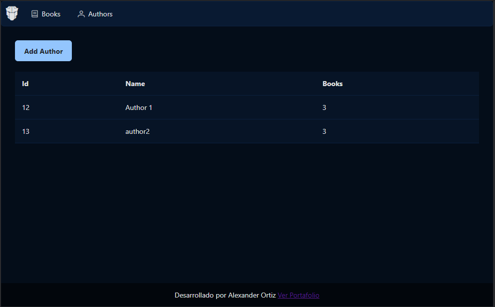
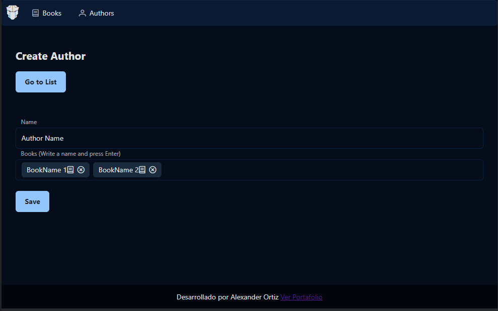
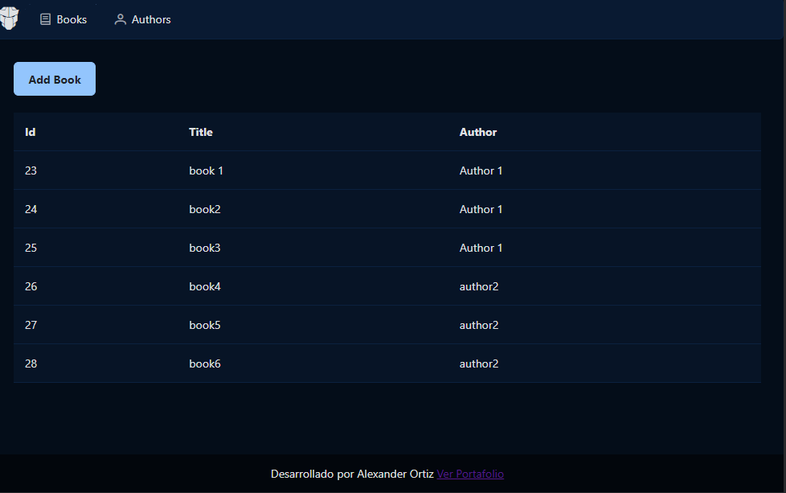
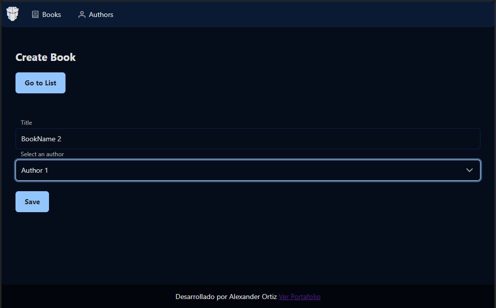
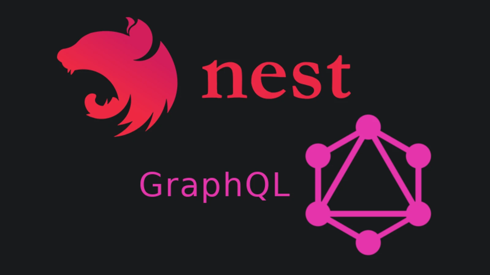
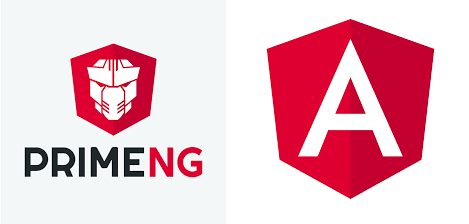

# Books GraphQL App

Aplicación para crear autores y relacionarlos con sus libros.  
Se uso : Angular 13, Apollo, Graphql, PrimeNG, NestJS, TypeORM, Postgresql

Requerimientos:
- Postgresql
- Angular CLI
- NestJS CLI

Instrucciones : 
- Crear base de datos y configurarla en APiGraphQL/ormconfig.json
- Validar que la opcion syncronize esté en true
- correr el comando npm run generate (generar graphql queries y mutaciones)
- correr el comando npm run start:dev dentro de APiGraphQL
- Validar el funcionamiento en localhost:3000
- correr el comando ng serve -o y verificar en localhost: 4200

